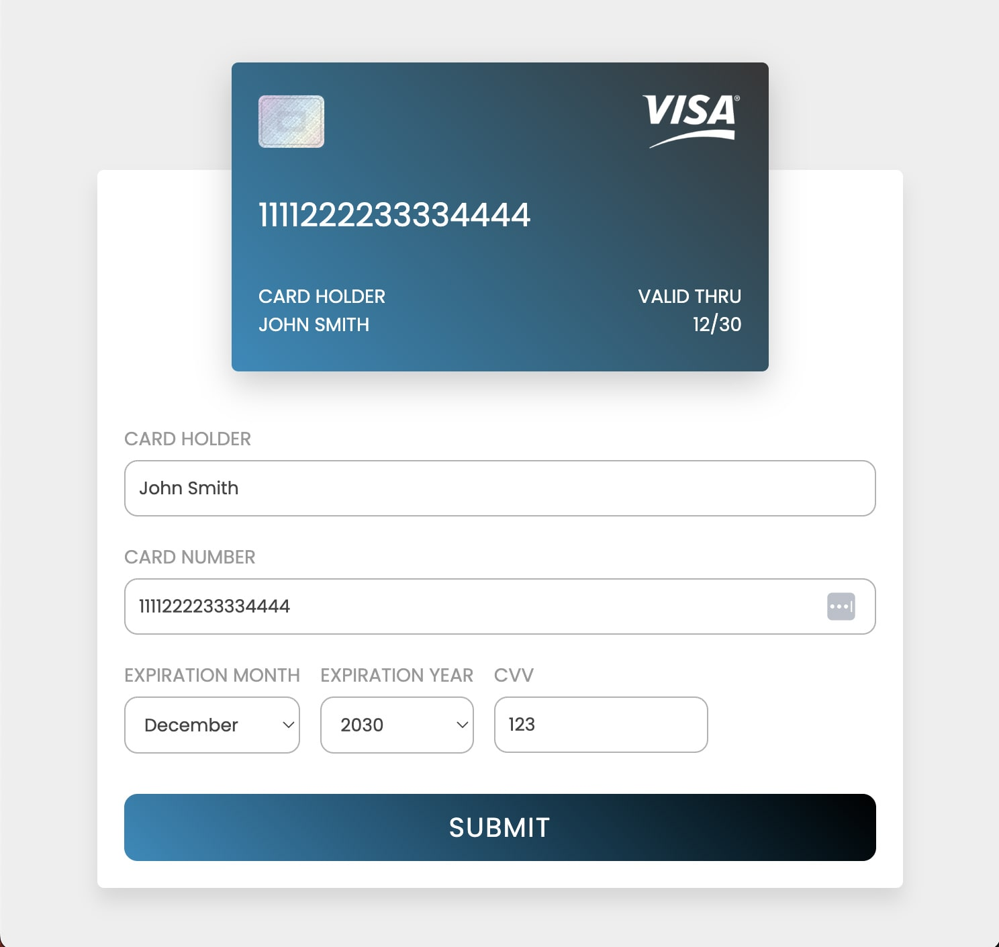

# react-credit-card-form
A simple credit card built in React to practice my react skills with.

Card information populates on the displayed credit card to emulate how information will look on a card.
Card will flip to show back of card and CVV when credit card is hovered or the CVV input is inFocus.

Simplified card validations include: 
* Confirming cardholder name is at least 3 characters long. 
* Confirming cardholder name has at least one space (firstname and lastname) 
* Card number length is 16 characters. 
* Card expiration month is selected. 
* Card expiration year is selected. 
* CVV length is 3 characters. 

When submitted, an alert will appear indicating if the card information is accepted or not accepted. 

